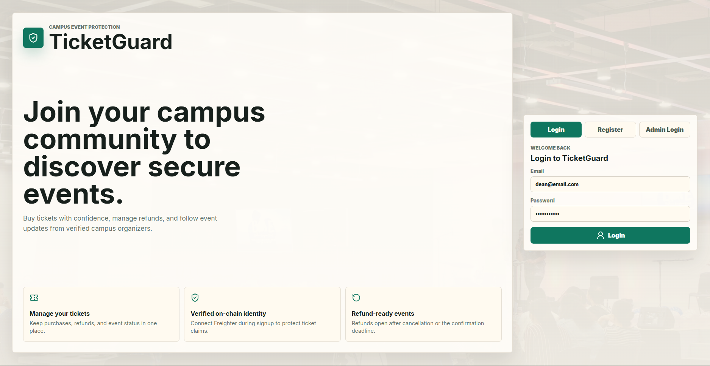
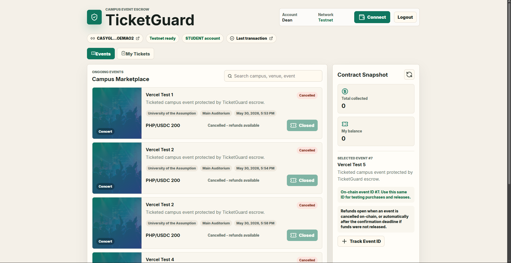
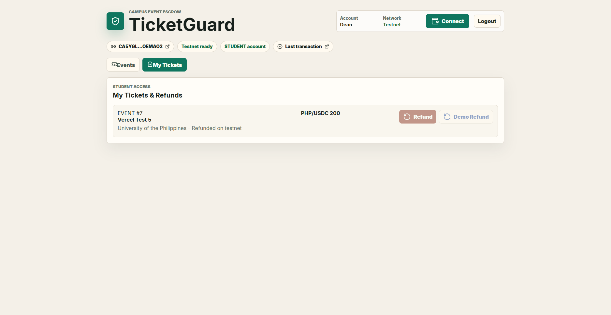
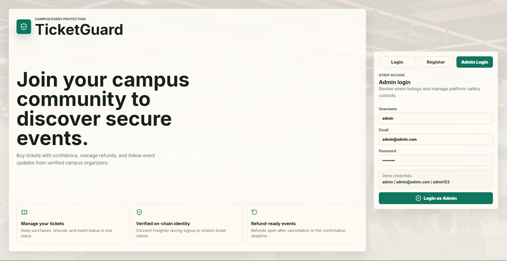
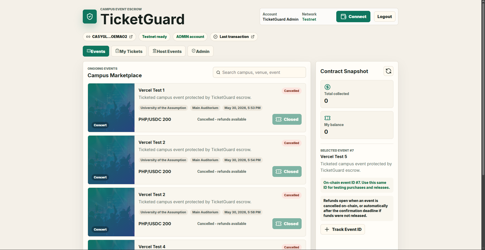
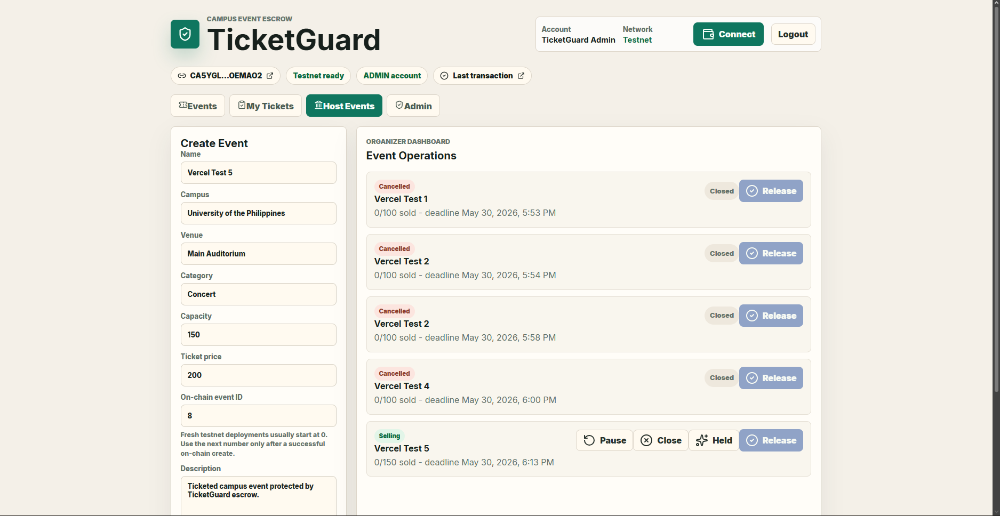
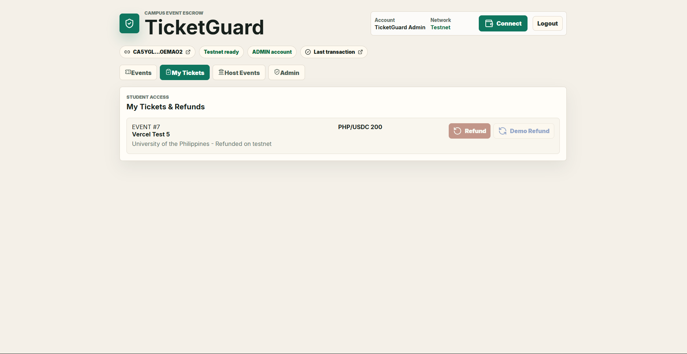
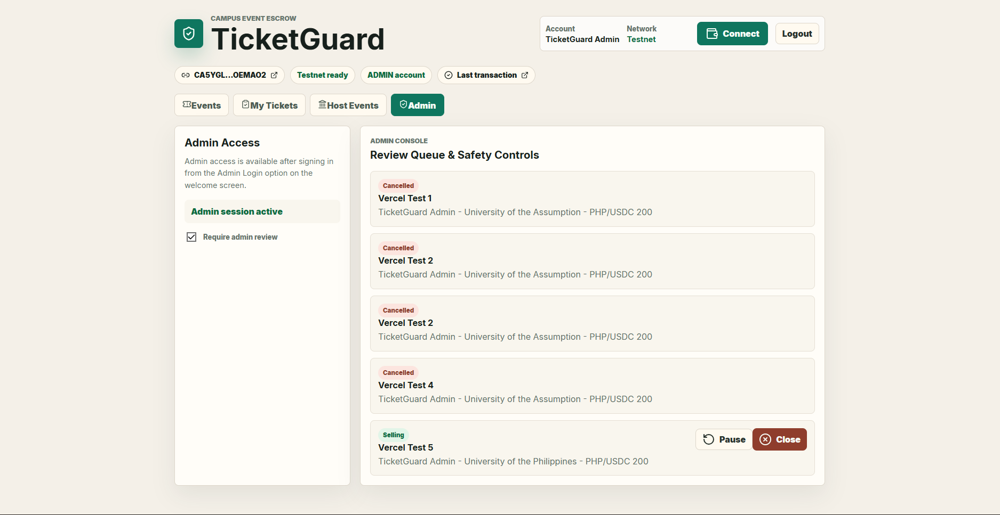
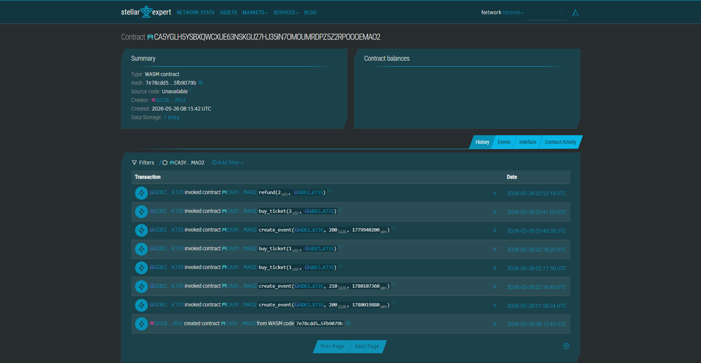

# TicketGuard

**TicketGuard is a Stellar Soroban campus event escrow demo.** It helps students buy paid event tickets with refund protection: ticket payments are locked in a smart contract, released to the organizer only when the event is confirmed, and refundable if the release window passes without confirmation.

## Why This Exists

Campus event payments are often handled through informal channels. If an event is cancelled, students may have no reliable way to recover their money. TicketGuard demonstrates how a student council or campus events office could use Stellar testnet escrow to make ticket collection more transparent and safer.

This project was built for a demo environment, so it intentionally uses local browser storage for accounts and event metadata while sending payment, release, and refund actions to the deployed Stellar testnet contract.

## Submission Checklist

| Requirement | Status |
| --- | --- |
| Deployed Stellar smart contract | [Stellar testnet contract](https://stellar.expert/explorer/testnet/contract/CA5YGLH5YSBXQWCXUE63NSKGU27HJ35IN7OMOUMRDPZ5Z2RPOOOEMAO2) |
| Source code repository | [GitHub repository](https://github.com/ldlumba/TicketGuard) |
| Project README | This document includes the project description, feature list, setup guide, operation guide, safety notes, screenshots, and deployment notes. |
| Screenshots or demo proof | See **Screenshot** and **Contract Activity Proof** below. |
| Deployed frontend | [TicketGuard on Vercel](https://ticket-guard.vercel.app) |

## What It Includes

- Vite, React, and TypeScript frontend.
- Freighter wallet connection on Stellar testnet.
- Student login and registration flow.
- Seeded demo student account.
- Admin login for event management.
- Event marketplace with ticket purchase actions.
- Admin-only event creation, review, approval, pause, close, held, and release flows.
- Ticket dashboard with real on-chain refund after the confirmation deadline.
- Demo-only cancelled-event refund simulation for presentations without redeploying the contract.
- Stellar.expert links for the deployed contract and latest submitted transaction.
- Soroban smart contract source and tests.

## Deployed Testnet Contract

| Item | Value |
| --- | --- |
| Network | Stellar testnet |
| Contract ID | `CA5YGLH5YSBXQWCXUE63NSKGU27HJ35IN7OMOUMRDPZ5Z2RPOOOEMAO2` |
| Explorer | [View on Stellar.expert](https://stellar.expert/explorer/testnet/contract/CA5YGLH5YSBXQWCXUE63NSKGU27HJ35IN7OMOUMRDPZ5Z2RPOOOEMAO2) |

## Deployed Frontend

The live demo is deployed on Vercel:

[https://ticket-guard.vercel.app](https://ticket-guard.vercel.app)

Use Freighter on Stellar testnet when testing contract actions from the deployed site.

## Demo Accounts

These accounts are frontend demo accounts stored locally in the browser. They are not real production credentials.

| Role | Email | Username | Password |
| --- | --- | --- | --- |
| Student | `dean@email.com` | - | `password123` |
| Admin | `admin@admin.com` | `admin` | `admin123` |

## Safety Notes

- Use **Stellar testnet only**.
- Do not use a wallet that holds mainnet funds.
- Do not enter private keys or seed phrases into this app.
- Freighter should be set to testnet before signing transactions.
- The demo account system uses local browser storage, not a secure backend database.
- The deployed contract uses testnet assets and testnet fees only.
- The **Demo Refund** button is local UI simulation only; it does not submit a Stellar transaction.

## Prerequisites

Install the following before running the full project:

- [Node.js](https://nodejs.org/) 20 or newer.
- npm, included with Node.js.
- [Freighter](https://www.freighter.app/) browser extension.
- Rust stable, only needed for contract builds.
- `wasm32-unknown-unknown` Rust target, only needed for contract builds.
- Stellar CLI, only needed for contract deployment or binding generation.

## Quick Start

```bash
npm ci
npm run dev
```

Open the local URL printed by Vite, usually:

```text
http://localhost:5173
```

For a production build:

```bash
npm run build
npm run preview
```

For code quality checks:

```bash
npm run lint
```

## Environment Variables

The app works without a `.env` file because safe testnet defaults are included.

| Variable | Default |
| --- | --- |
| `VITE_TICKETGUARD_CONTRACT_ID` | `CA5YGLH5YSBXQWCXUE63NSKGU27HJ35IN7OMOUMRDPZ5Z2RPOOOEMAO2` |
| `VITE_STELLAR_RPC_URL` | `https://soroban-testnet.stellar.org` |

If you redeploy the contract, create a local `.env.local` file and set:

```bash
VITE_TICKETGUARD_CONTRACT_ID=YOUR_TESTNET_CONTRACT_ID
VITE_STELLAR_RPC_URL=https://soroban-testnet.stellar.org
```

Do not commit `.env.local`.

## How To Operate The Demo

### Student Flow

1. Open the app.
2. Log in with `dean@email.com` and `password123`, or register a new student account.
3. Connect Freighter on Stellar testnet.
4. Open the **Events** tab.
5. Select an event that is marked as selling.
6. Click **Pay** and approve the Freighter transaction.
7. Check the latest transaction link or the contract page on Stellar.expert.
8. Open **My Tickets** to view the ticket and refund options.

### Admin Flow

1. Open the app.
2. Choose admin login.
3. Use username `admin`, email `admin@admin.com`, and password `admin123`.
4. Connect the organizer/admin Freighter wallet on Stellar testnet.
5. Use **Host Events** to create an event on-chain.
6. Use **Admin** to approve, pause, close, or reject events.
7. Mark an event as held before releasing funds.
8. Use **Release** only when the event has purchases, the deadline has not passed, and the connected wallet is the organizer wallet.

### Real Refund Test

The deployed contract allows a student refund after the confirmation deadline if funds have not been released.

1. Create an event with a short confirmation deadline.
2. Buy a ticket as a student before the deadline.
3. Do not release funds as admin.
4. Wait until the deadline passes.
5. Return to **My Tickets**.
6. Click **Refund** and approve the Freighter transaction.
7. Confirm the transaction on Stellar.expert.

### Demo Cancelled-Event Refund

The current deployed contract does not include immediate cancellation refunds. The source contract has been updated with cancellation support, but using that on-chain requires redeploying and updating the contract ID.

For presentations, use **Demo Refund** in **My Tickets**. It marks the ticket as refunded in local app state and marks the event cancelled in the UI. This is intentionally labelled as local simulation and does not alter the Stellar contract.

## Contract Build

The Soroban contract is in `contracts/ticketguard`.

```bash
rustup target add wasm32-unknown-unknown
cargo build --target wasm32-unknown-unknown --release
```

If you change and redeploy the contract, also update the frontend contract ID through `VITE_TICKETGUARD_CONTRACT_ID`.

## Deployment

### Vercel

The current live deployment uses Vercel. Use the default Vite settings:

| Setting | Value |
| --- | --- |
| Live URL | [https://ticket-guard.vercel.app](https://ticket-guard.vercel.app) |
| Build Command | `npm run build` |
| Output Directory | `dist` |
| Install Command | `npm ci` |

### Vercel Demo Limits

The Vercel application is a static frontend connected directly to Freighter and the Stellar testnet RPC. It is suitable for reviewing the escrow flow, but it has the following demo limits:

- Accounts are stored in browser local storage, so they are not shared across devices or browsers.
- Event metadata is stored locally for the UI, while escrow balances and ticket/refund actions are verified on-chain.
- A fresh browser may need a newly created or tracked on-chain event before purchases are available.
- The connected Freighter wallet must be on Stellar testnet and funded with testnet XLM.
- Admin actions are demo-gated by local login credentials, not by production-grade backend authentication.
- The currently deployed contract supports real refunds after the confirmation deadline if funds were not released.
- Immediate cancellation refunds are available as a clearly labelled frontend simulation unless the updated cancellation-enabled contract is redeployed.
- The app should not be used with mainnet funds, private keys, or production user data.

## Screenshots

Primary application screenshot:


Additional screenshots are grouped by the account type chosen during login.

<details>
<summary><strong>Expand to view Regular Access screenshots</strong></summary>

### Regular Access - Login



### Regular Access - Events



### Regular Access - Tickets



</details>

<details>
<summary><strong>Expand to view Admin Access screenshots</strong></summary>

### Admin Access - Login



### Admin Access - Events



### Admin Access - Host Events



### Admin Access - Ticket View



### Admin Access - Dashboard



</details>

## Contract Activity Proof

The deployed testnet contract is publicly verifiable on Stellar.expert. The screenshot below shows the contract activity history with successful `create_event`, `buy_ticket`, and `refund` calls.

[Open the live TicketGuard contract on Stellar.expert](https://stellar.expert/explorer/testnet/contract/CA5YGLH5YSBXQWCXUE63NSKGU27HJ35IN7OMOUMRDPZ5Z2RPOOOEMAO2)



## Notes For Future Work

- Replace local browser accounts with a backend authentication service.
- Add a dedicated indexer or backend to discover on-chain event IDs automatically.
- Redeploy the updated cancellation-enabled contract when immediate on-chain cancellation refunds are required.
- Add production asset handling for real USDC or a campus-approved stablecoin flow.
